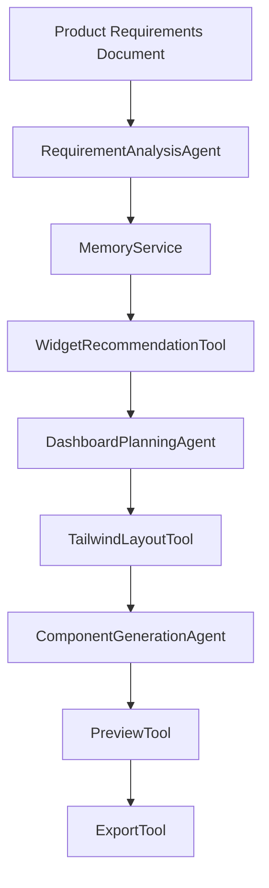
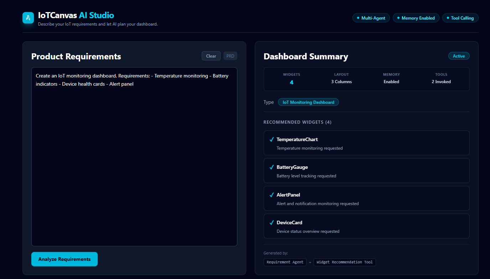
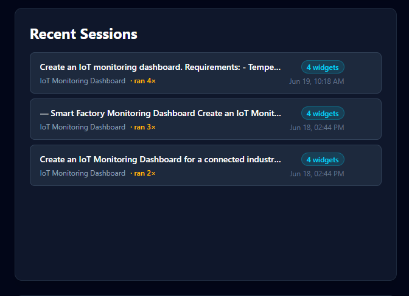
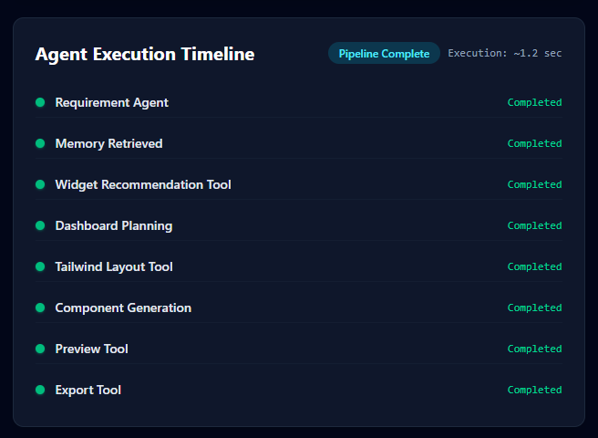
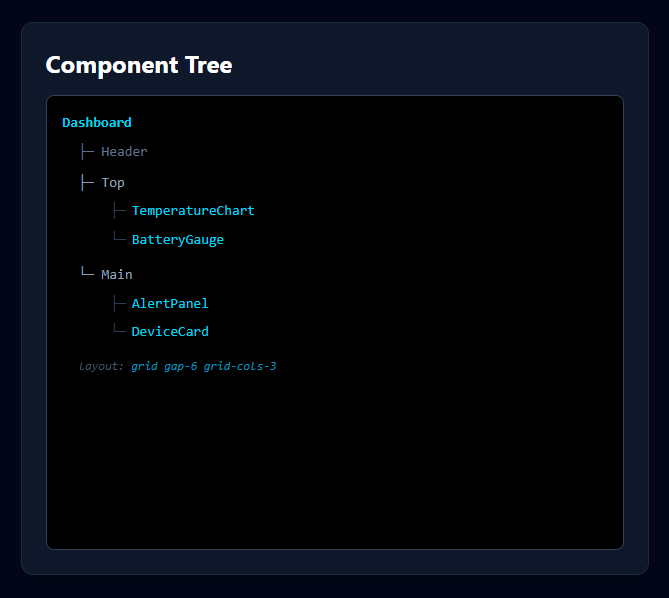
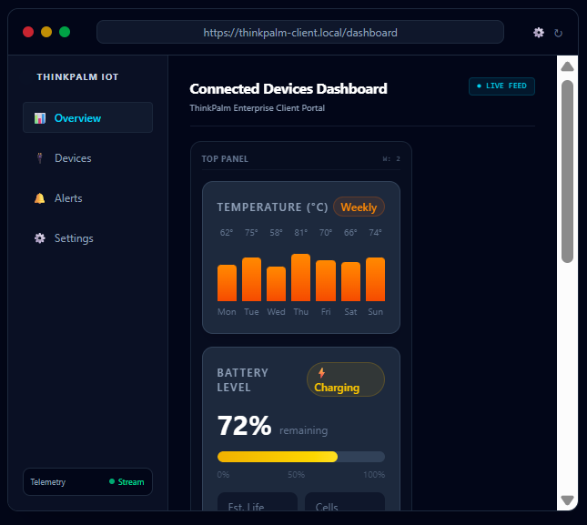
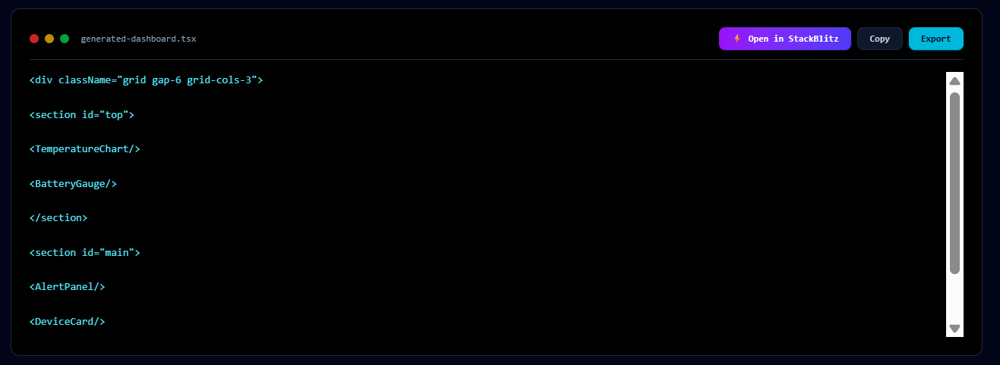

# IoTCanvas AI Studio

[](https://nextjs.org/)
[](https://react.dev/)
[](https://www.typescriptlang.org/)
[](https://tailwindcss.com/)

A modern, multi-agent AI-powered IoT dashboard planning and generation suite. IoTCanvas AI Studio allows delivery engineers to parse product requirements documents (PRDs) into structured layout plans, recommended widgets, interactive components trees, and exportable production-grade React components in seconds.

---

## Project Overview

**IoTCanvas AI Studio** is designed as a delivery engineer's workspace for prototyping IoT client dashboards. By pasting a dashboard requirement specification, the tool initiates a multi-agent pipeline that analyzes the PRD, identifies key metrics, maps telemetry specifications to visual widgets, and automatically lays out those widgets on a customizable grid.

---

## Problem Statement

When delivering connected-device projects to clients, engineers face a disconnect between initial requirements specifications and the visual layout of dashboard components. Prototyping layouts, mapping specific widgets (like charging gauges or heat charts), structuring grid containers, and generating clean React code takes valuable cycles. IoTCanvas AI Studio solves this by automating the requirement-to-code pipeline through coordinated agents, providing interactive, live adjustments, and generating instant cloud development sandboxes.

---

## Team Members and Contributions

| Team Member | Role | Contribution Matrix |
| ------------------- | ------------------------ | ------------------------------------------------------------------------------------------------------------------------------------------------------------------------------------------------------------------------------------------------------------------------------------- |
| **Keerthi C**       | Senior Software Engineer | Co-designed and implemented the multi-agent pipeline, UI architecture, requirement analysis workflow, memory integration, component tree interaction, live preview system, export workflow, Tailwind interface improvements, testing, documentation, and overall project integration. |
| **Kavya Sebastian** | Senior Software Engineer | Co-designed and implemented the multi-agent pipeline, widget generation workflow, layout planning, dashboard rendering, export functionality, UI enhancements, testing, documentation, and overall project integration.                                                               |

### Collaboration Model

This project was developed collaboratively across all major areas including architecture, implementation, UI development, testing, and documentation. Responsibilities were shared rather than strictly separated to ensure end-to-end consistency across the agent pipeline and user experience.

---

## Tech Stack with Versions

The project is built on the following stack:

* **Framework**: Next.js `16.2.7` (App Router configuration)
* **Core Library**: React `19.2.4` (using client state transitions and hooks)
* **Language**: TypeScript `^5.0.0` (fully type-safe modules)
* **Styling**: Tailwind CSS `^4.0.0` (with PostCSS configurations)
* **IDE Sandbox Exporter**: StackBlitz POST API integration

---

## Step-by-Step: How to Run Locally

Follow these steps to launch the workspace on your local machine:

1. **Clone the Repository**:
   ```bash
   git clone https://github.com/keerthiNandhu/iotcanvas-ai-studio.git
   cd iotcanvas-ai-studio
   ```

2. **Install Project Dependencies**:
   Ensure you have Node.js version 18+ installed.
   ```bash
   npm install
   ```

3. **Start the Next.js Local Server**:
   ```bash
   npm run dev
   ```

4. **Access the Workspace**:
   Open your browser and navigate to `http://localhost:3000`.

---

## Features

| Feature Group | Description |
|---|---|
| 🤖 **Multi-Agent Pipeline** | Coordinated agents analyze text, plan layout positioning, and generate matching configurations. |
| ⚡ **Agent Timeline** | Interactive execution timeline showing agent runs, tool invocation transitions, and processing time. |
| 🛠️ **Interactive Component Tree** | Add, delete, and move widgets up/down across sections dynamically, updating layout and code reactively. |
| 📊 **Dashboard Summary** | Shows parsed telemetry metrics, recommended widgets, layout columns, and active tool counts. |
| 🌐 **Live Website Preview** | Embedded browser simulator showing how widgets (Temperature, Battery, Alerts) render in real-time. |
| 💻 **Code Terminal Preview** | Production-ready TSX block with dynamic Tailwind grids, one-click copy, and file export. |
| 💾 **Memory History** | Persists up to 5 historical sessions locally, permitting one-click recall to PRD editors. |
| ⚡ **StackBlitz Sandboxes** | Compile and launch a running online Vite+React development workspace with a single click. |

---

## Architecture

The project employs a modular, agentic structure passing telemetry contexts through a sequential pipeline:



---

## Folder Structure

Below is the directory layout of the application showing the required submission structure:

```text
├── src/                  # All source code
│   ├── app/              # Next.js App Router (layout, page, styles)
│   ├── components/       # Core studio panels (PRDInput, DashboardSummary, Timeline, tree, etc.)
│   ├── agents/           # AI pipeline agent classes
│   ├── memory/           # LocalStorage session serializer
│   ├── tools/            # Layout grid & widgets helpers
│   ├── widgets/          # Standard visual telemetry components
│   ├── hooks/            # React hook definitions
│   ├── services/         # General business services
│   ├── types/            # Domain interfaces
│   └── lib/              # Shared utility helpers (cn)
├── docs/                 # Architecture diagram & 1-page write-up
│   ├── architecture-diagram.svg # Flowchart SVG vector diagram
│   └── architecture-writeup.md  # 1-page architectural specifications
├── tests/                # Integrated pipeline tests
│   └── pipeline.test.ts  # Node.js TAP unit tests
├── README.md             # Project overview & running instructions
└── package.json          # Dependency configurations
```


---

## Sample PRD Input

```text
Create an IoT monitoring dashboard.

Requirements:
* Temperature monitoring
* Battery tracking
* Device health cards
* Alert notifications
```

---

## Example Dashboard Summary

When the PRD above is processed, the **Dashboard Summary** displays:
- **Type**: IoT Monitoring Dashboard
- **Layout**: 3 Columns
- **Widgets**: 4 Generated
- **Recommended List**:
  - `✓ TemperatureChart` — Temperature monitoring requested
  - `✓ BatteryGauge` — Battery level tracking requested
  - `✓ AlertPanel` — Alert and notification monitoring requested
  - `✓ DeviceCard` — Device status overview requested

---

## Example Component Tree

The interactive builder renders the structured hierarchy:

```text
Dashboard
├─ Header
├─ Top
│  ├─ DeviceCard
│  └─ TemperatureChart
├─ Main
│  ├─ BatteryGauge
│  └─ AlertPanel
layout: grid gap-6 grid-cols-3
```

---

## Example Exported React Code

The generated TSX file exports:

```tsx
<div className="grid gap-6 grid-cols-3">

<section id="top">

<DeviceCard/>

<TemperatureChart/>

</section>

<section id="main">

<BatteryGauge/>

<AlertPanel/>

</section>

</div>
```

---

## Screenshots of Working Prototype

Below are screenshots representing the key modules inside the workspace:

* **Main Workspace** (PRD input + Dashboard Summary): 
* **Recent Sessions**: 
* **Agent Executions**: 
* **Component Tree Editor**: 
* **Live Telemetry Preview**: 
* **TSX Code Preview**: 

---

## Testing Checklist

- [x] Inputting PRD parses and triggers the full agent pipeline
- [x] Dashboard Summary shows dashboard type, layout columns, widget count, and recommended widgets with reasons
- [x] Timeline steps animate sequentially with correct status states
- [x] Component tree permits appending widgets via `+ Add` dropdown
- [x] Delete triggers on tree node updates previews and code templates
- [x] Moving widgets changes positioning and grids reactively
- [x] Clicking history session restores input parameters
- [x] StackBlitz exporter creates project and launches sandbox in tab

---

## Demo Video

[](https://www.loom.com/share/your-video-id-here)

*Click the badge above to watch the 5-minute Loom video walking through the interactive features.*

---

## Future Improvements

* **LLM Integration**: Live Claude-3.5-Sonnet API support via Settings keys configuration.
* **Advanced Widgets**: Introducing maps trackers, gauge gauges, and tabular charts.
* **Export Formats**: Standardized Docker compose setups, Next.js templates, and raw CSS modules.
* **Real IoT Data**: Setting up active WebSockets connecting to mock MQTT brokers.

---

## Authors
**Team Alpha**
* **Keerthi C** — Senior Software Engineer
* **Kavya Sebastian** — Senior Software Engineer

